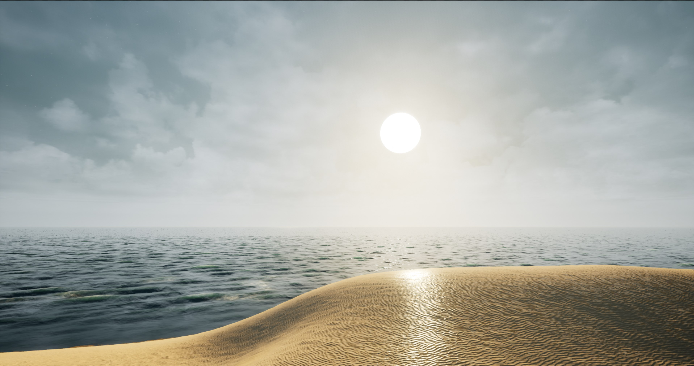
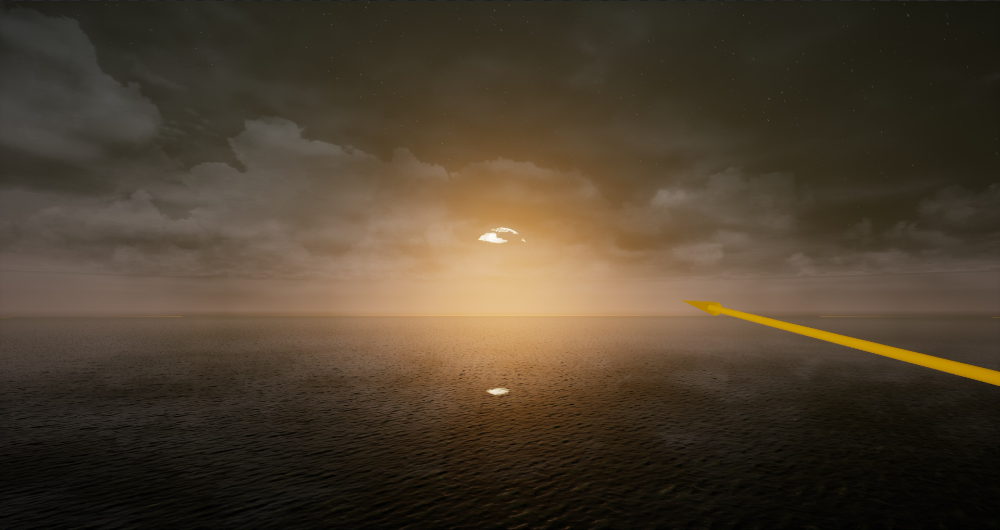
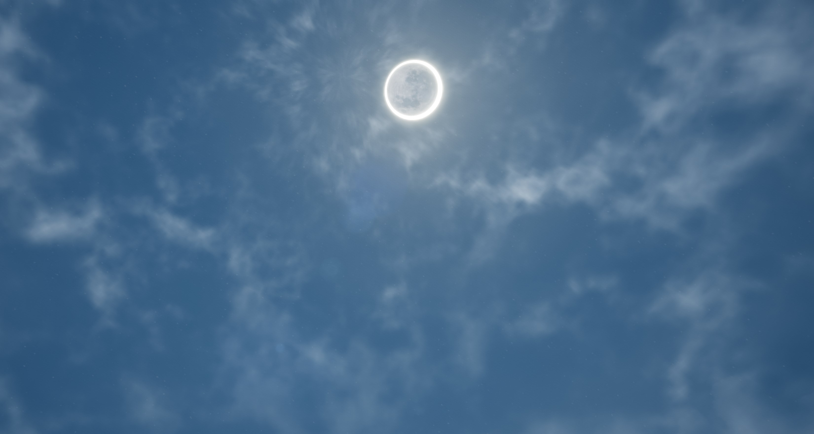
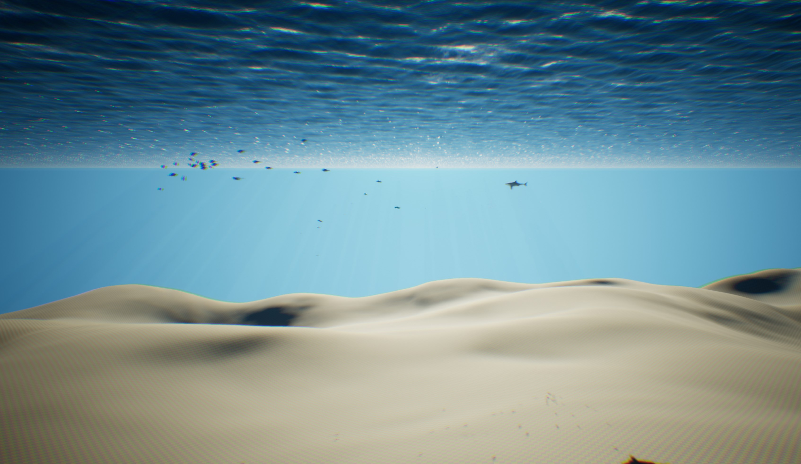

# EnvironmentProject
An Environment Simulation project for Unreal Engine 4.

Includes everything from the Ocean Project (LEGACY and <= 4.20 versions) but split up into muliple plugins now:
Buoyancy
Ocean
Fish
Sky
Time

Visit the #faq channel in discord for fixes with known issues:
https://discord.gg/Xzrbpup

UE4 Forum: (I don't really use it. Would prefer on discord)
https://forums.unrealengine.com/community/community-content-tools-and-tutorials/1687848-the-environment-community-project-the-ocean-project

---------------------

**MASTER Branch - Currently the Environment project, this took the ocean plugin and split it up into multiple plugins**
**LEGACY AND ANY VERSION BELOW 4.20 - Effectivly the same as Environment project, main difference is everything is in a single plugin***

**PLEASE NOTE**
**This branch is NOT guaranteed to properly compile or be stable at all times. This branch will be updated between major UE4 releases with the latest changes, and periodically will be compiled out to a new branch for each new UE4 release, and when major changes occur.**

**Please use the branch associatd with your UE4 engine version for the best compatability.**

---------------------

