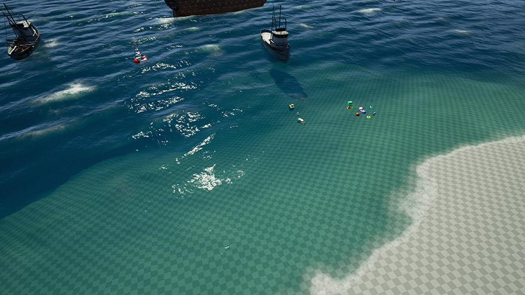

# OceanProject
An Ocean Simulation project for Unreal Engine 4.

---------------------

**4.12 Branch - This is the most up to date branch compatible with UE 4.12.x**

New features in added in 4.10:

* Underwater post process with exponential fog
* Stencil-based underwater masking
* Wet lens post process
* Landscape heightmap-based displacement modulation
* OceanStorm example map (40 Gerstner waves)
* Advanced BuoyantMesh component by Nubtron
* Accurate height readback by accounting for x,y displacement
* Harpoon gun with rope physics
* Various code improvements
* Various shader improvements  
(Visit the forum thread for more info)

===================================================================

Vote for upcoming features on our [Trello](https://trello.com/b/7dzOdkvw/ue4-ocean-weather-project)

UE4 Forums thread with more info: [[Community Project] WIP Weather & Ocean Water Shader](https://forums.unrealengine.com/showthread.php?42092-Community-Project-WIP-Weather-amp-Ocean-Water-Shader)

If you would like to contribute to this project, please PM me on the UE4 forums with your GitHub user name and contact info.
